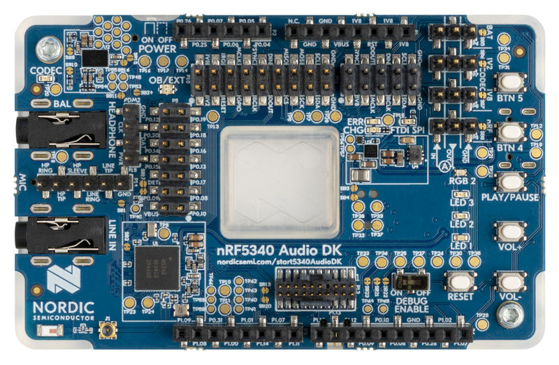
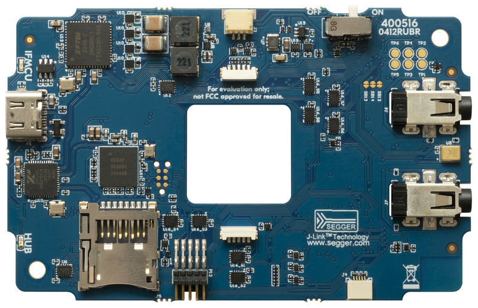

nRF5340 Audio User guide
########################

Version
*******

+-------------------+-------------------------+-----------+
| Date              | For FW version          | Comment   |
+===================+=========================+===========+
| 20. December 2021 | nrf5340_audio_0.4.0     |           |
+-------------------+-------------------------+-----------+

Purpose
*******

This manual shows how to operate the prototype nRF5340 Audio FW on the nRF5340 Audio DK.
This FW and HW package demonstrates audio over ISO using LC3 codec compression and decompression.

Disclaimer
**********

Prototype status implies that:

* Development is *work in progress*.
  Features may be added or removed without notice.
* Documentation is not present of lacunar.
* No quality verification process implemented.
* Performances are not characterized, should be considered for evaluation only.
* Nordic bears no obligation to continue development in case it solely decides to stop it.
* To be able to use the LC3 codec, an NDA shall be signed first.

Warranty disclaimer
*******************

THIS HARDWARE AND SOFTWARE IS PROVIDED BY THE COPYRIGHT HOLDERS AND CONTRIBUTORS "AS IS" AND ANY EXPRESS OR IMPLIED WARRANTIES, INCLUDING, BUT NOT LIMITED TO, THE IMPLIED WARRANTIES OF MERCHANTABILITY, AND FITNESS FOR A PARTICULAR PURPOSE ARE DISCLAIMED.
IN NO EVENT SHALL NORDIC SEMICONDUCTOR ASA OR CONTRIBUTORS BE LIABLE FOR ANY DIRECT, INDIRECT, INCIDENTAL, SPECIAL, EXEMPLARY, OR CONSEQUENTIAL DAMAGES (INCLUDING, BUT NOT LIMITED TO, PROCUREMENT OF SUBSTITUTE GOODS OR SERVICES, LOSS OF USE, DATA, OR PROFITS, OR BUSINESS INTERRUPTION) HOWEVER CAUSED AND ON ANY THEORY OF LIABILITY, WHETHER IN CONTRACT, STRICT LIABILITY, OR TORT (INCLUDING NEGLIGENCE OR OTHERWISE) ARISING IN ANY WAY OUT OF THE USE OF THIS SOFTWARE, EVEN IF ADVISED OF THE POSSIBILITY OF SUCH DAMAGE.

Parts needed for demo
*********************

nRF5340 Audio DK 0.9.X (PCA10121) top view
==========================================

nRF5340 Audio DK 0.9.X (PCA10121) bottom view
=============================================

Included
========

* nRF5340 Audio DK (PCA10121 version 0.8.X/0.9.0).
  Two or three kits are required for a useful demo.

Required additional parts
=========================

* USB-C cable for power, programming and UART
* Standard 3.5 mm, 3-pole jack headphone

I/O on nRF5340 Audio DK 0.8.X/0.9.0 (PCA10121)
**********************************************

Buttons
=======

+---------------+------------------------------------------------------+
| Button        | Function                                             |
+===============+======================================================+
| VOL-          | Volume down (and unmute)                             |
| VOL+          | Volume up (and unmute)                               |
| BTN3          | Play/pause                                           |
| BTN4          | Toggle between test tones and audio (gateway only)   |
| BTN5          | Mute volume                                          |
+---------------+------------------------------------------------------+

LEDs
====

+-----------------------+-----------------------------------------------------------------------------------------------+
| LED	                  | Indication                                                                                    |
+=======================+===============================================================================================+
|LED1                   |*Off*: No Bluetooth connection                                                                 |
|                       |*Solid blue*: Kits have connected or found a broadcast Streaming                               |
|                       |*Blinking blue*: Streaming audio                                                               |
+-----------------------+-----------------------------------------------------------------------------------------------+
|LED2                   |Headset only:                                                                                  |
|                       |*Off*: Sync not achieved                                                                       |
|                       |*Solid green*: Sync achieved                                                                   |
+-----------------------+-----------------------------------------------------------------------------------------------+
|LED3                   |*Blinking green*: Indicates running nRF5340 APP core                                           |
+-----------------------+-----------------------------------------------------------------------------------------------+
|CODEC                  |*Off*: No config loaded to on-board HW codec                                                   |
|                       |*Solid green*: Configuration loaded                                                            |
+-----------------------+-----------------------------------------------------------------------------------------------+
|RGB1 (center opening)  |*Green*: Gateway                                                                               |
|                       |*Blue*: Headset_L                                                                              |
|                       |*Magenta*: Headset_R                                                                           |
|                       |*Red*: APP core fault has occurred.                                                            |
|                       |       In debug mode, see UART output for details.                                             |
+-----------------------+-----------------------------------------------------------------------------------------------+
|RGB2                   |Controlled by the BLE controller on the net core:                                              |
|                       |*Green*: Shows CPU activity.                                                                   |
|                       |*Red*: Error.                                                                                  |
|                       |*White (all colors on)*: Indicates that the RGB LED is not initialized by the BLE controller.  |
+-----------------------+-----------------------------------------------------------------------------------------------+
|ERR                    |Indicates PMIC/charging error.                                                                 |
+-----------------------+-----------------------------------------------------------------------------------------------+
|CHG                    |*Solid yellow*: Charging                                                                       |
|                       |*Off*:  Charge completed/no battery connected                                                  |
+-----------------------+-----------------------------------------------------------------------------------------------+
|OB/EXT	                |*Off*: No 3.3 V power                                                                          |
|                       |*Green*: Indicates on-board codec selected                                                     |
+-----------------------+-----------------------------------------------------------------------------------------------+
|FTDI SPI               |*Off*: Normal.                                                                                 |
|                       |*Yellow*: Indicates that the FTDI has control over the CS47L63 SPI lines.                      |
+-----------------------+-----------------------------------------------------------------------------------------------+
|IFMCU (bottom side)    |*Off*: No PC connection                                                                        |
|                       |*Solid green*: Connected to PC                                                                 |
|                       |*Rapid green flash*: Failed USB enumeration                                                    |
+-----------------------+-----------------------------------------------------------------------------------------------+
|HUB (bottom side)      |*Off*: No PC connection                                                                        |
|                       |*Green*: Standard USB hub operation                                                            |
+-----------------------+-----------------------------------------------------------------------------------------------+

Starting the demo
*****************

* The kits come pre-flashed with a connected isochronous stream (CIS) demo.
  In this demo, one gateway device will connect to up to two headset devices.
  Depending on what channel is set for each headset when flashed, they will receive the corresponding audio channel from gateway.
* Make sure kits have power.
  First connect with USB-C.
  When running, headset devices can be battery powered.
* Switch power to "ON" on both kits.
* If the kits are not flashed:

  * Install the most recent version of `nrfjprog and JLink <https://www.nordicsemi.com/Software-and-tools/Development-Tools/nRF-Command-Line-Tools/Download>`_.
  * Open a command prompt and run ``nrfjprog -i``, the SEGGER IDs printed on the labels should both appear.
  * Flash both NET cores: ``nrfjprog --program <NET hex> --chiperase --coprocessor CP_NETWORK -r``.
  * Then flash each APP core with its respective APP hex ``nrfjprog --program <APP hex> --coprocessor CP_APPLICATION --sectorerase -r``.
    Note which device is flashed with the gateway and the headset hex.
  * If the devices will not be programmed due to protection, run: ``nrfjprog --recover --coprocessor CP_NETWORK`` and then  ``nrfjprog --recover``, and program both cores again.
  * If there are two headset devices to be used, the UICR should be populated with the desired channel for each headset.
    Use the following command, depending on which headset you want to populate:

    * Left: ``nrfjprog --memwr 0x00FF80F4 --val 10``
    * Right: ``nrfjprog --memwr 0x00FF80F4 --val 20``

    Select the correct board when prompted with a pop up, or add ``--snr`` (SEGGER number of the correct board) at the end of the nrfjprog command.

* LED1 will blink blue when powered on the gateway device for the CIS demo once the first headset is connected.
* A sound playback device will appear in Windows *nRF5340 USB Audio*.
  Make sure you select this as output.
* Connect headphones to the **HEADPHONE** jack on the headset device(s).
* LEDs should light according to the table above.
  With LED1 solid blue, press the play/pause button on a headset device.
  LED1 should blink blue and audio will pass through.
* Power off the nRF5340 Audio DKs by switching the power switch from on to off.

Optional
********

nRF5340 Audio DK with debug firmware flashed also declares three USB<->UART ports.
Use dev/ttyACM0 in Linux.
Windows will enumerate these differently, so open them in succession until there is data flowing.
UART Parameters:

* Baud: 1 000 000
* 8N1
* No flow control
